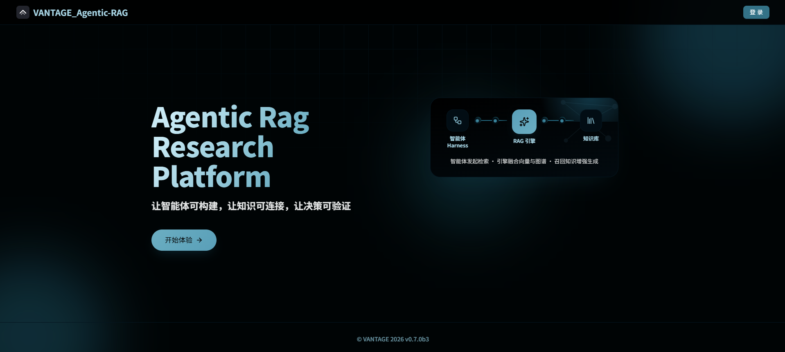
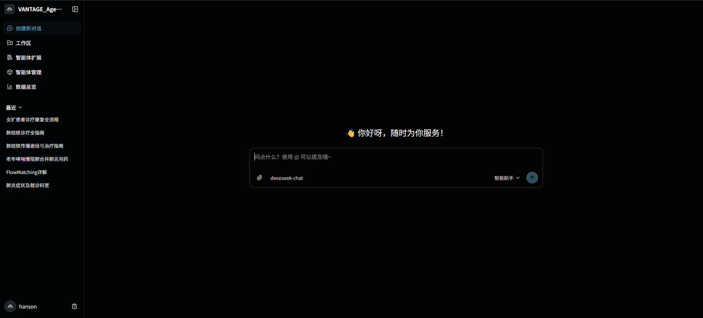
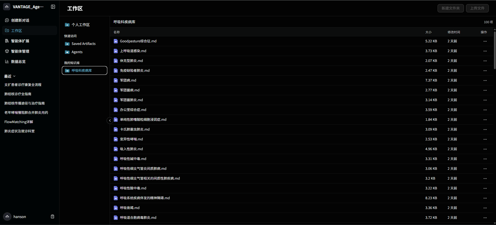
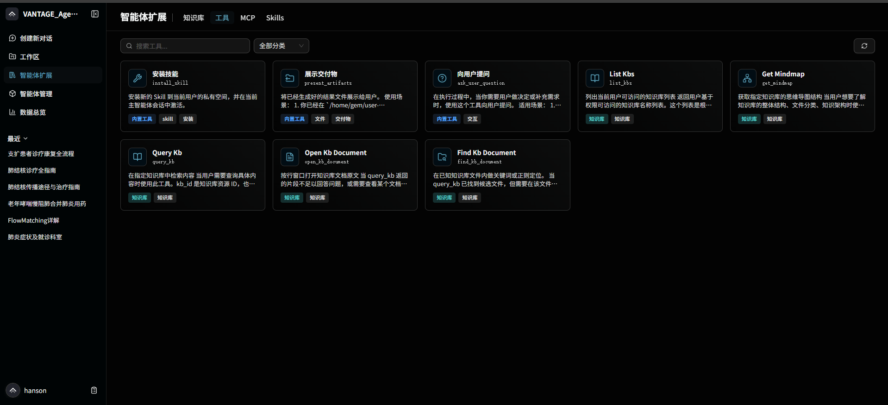
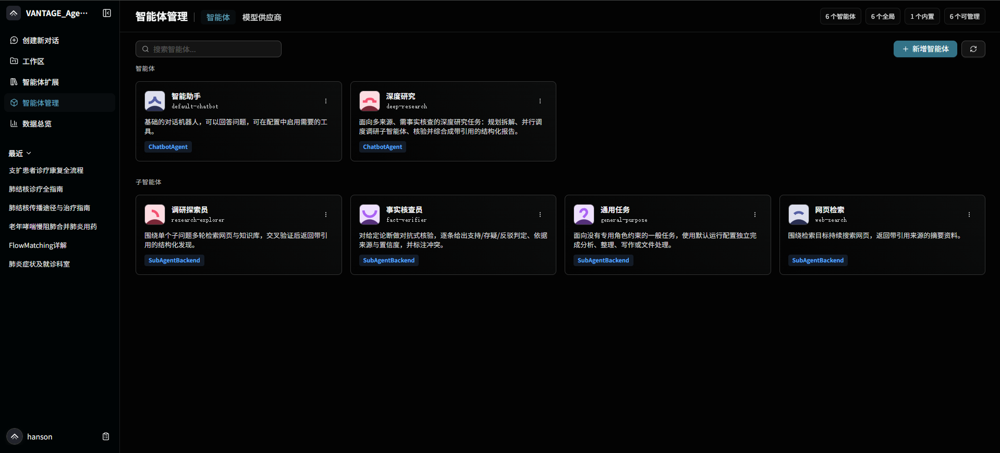
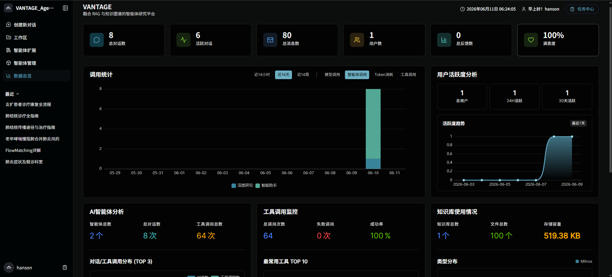
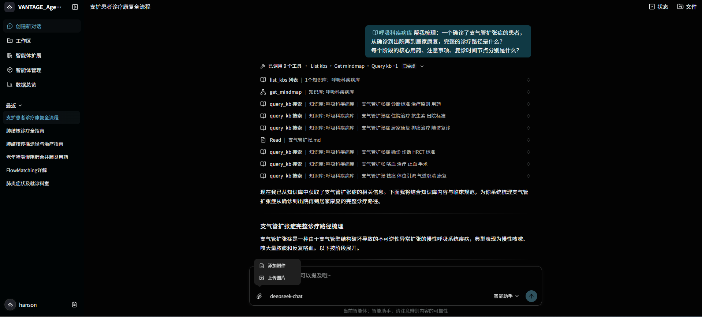

<div align="center">

# VANTAGE · Agentic RAG 知识库平台

**向量检索 + 知识图谱 + 智能体自适应路由**

让智能体可构建 · 让知识可连接 · 让决策可验证

[](https://www.python.org/)
[](https://fastapi.tiangolo.com/)
[](https://github.com/langchain-ai/langgraph)
[](https://vuejs.org/)
[](https://milvus.io/)
[](https://neo4j.com/)
[](https://www.docker.com/)
[](LICENSE)



</div>

---

## 📖 项目简介

**VANTAGE** 是一个**生产级的通用 Agentic RAG 知识库平台**：客户接入自己的私有文档，即可构建一套"向量检索 + 知识图谱"双引擎、由大模型智能体自适应路由的问答系统。领域不限——本仓库以**医药（呼吸内科）100 篇知识文档**作为验证场景，把效果跑通并量化。

它要解决的核心痛点是：**传统向量 RAG 只懂"语义相似"，在需要沿实体关系游走的"多跳关系问题"上召回很差。** VANTAGE 的思路是：

> 用 **知识图谱** 补上向量 RAG 在多跳关系问题上的硬伤，再用一个 **大模型驱动的 Agent 做自适应检索路由**——简单问题走轻量混合检索、复杂关系问题才触发图谱多跳推理，从而在 **效果 / 成本 / 延迟** 之间取得最优平衡。

整套系统打通 **离线构建 → 在线检索 → 自动化评测** 三条流水线，可量化、可迭代、可上线，单机 16GB 即可运行。


---

## ✨ 核心亮点

### 1️⃣ 混合检索管线（Dense + Sparse + Rerank）
针对"向量 RAG 对专名 / 多跳召回差"的痛点，实现 **稠密向量（Milvus `IVF_FLAT` / `COSINE`）+ BM25 稀疏** 双路召回，经 `WeightedRanker` 加权融合，再叠加 **Cross-Encoder 精排**（召回 50 → 精排 10）。检索超参由评测确定而非经验拍定，整体 **Recall@5 由 0.71 提升至 0.86（+15pp）**。

### 2️⃣ 知识图谱增强检索 · HippoRAG 式（核心亮点）
用 **LLM 自动抽取实体 / 三元组** 构建 Neo4j 知识图谱（**2,317 实体 / 4,856 关系**）；检索时按 query 召回种子实体，在 **2-hop 子图上运行 Personalized PageRank** 对段落重排序，再以 **RRF** 与向量结果跨源融合。在多跳关系问题上 **Recall@5 +33%、答案准确率由 0.66 提升至 0.84（+27%）**。

### 3️⃣ Agentic 自适应检索路由（效果 / 成本 / 延迟权衡）
图谱多跳效果好，但需逐 chunk 调用 LLM，又贵又慢。基于 **LangGraph** 将知识库能力封装为工具集（检索 / 文件内定位 / 读原文 / 查库结构），由 LLM 按问题复杂度**自主决策检索路径**——简单事实问题走轻量混合检索、复杂关系问题才触发图谱多跳。相比"无脑全开图谱"，**降低 38% LLM 成本、46% 平均延迟，整体准确率仅降 0.6pp**，近乎无损省成本。

### 4️⃣ 零标注自动化评测 HARNESS + 端到端工程化
自研**零人工标注**评测流水线：基于知识库自动生成 **220 道测试题**（含 100 道由图谱 PPR 扩散生成的跨文档多跳题，以 `gold_chunk_ids` 子集约束保证 ground truth），用 **Recall@K / F1@K + LLM-as-Judge** 对"纯向量 / 混合+精排 / 图谱增强"三组策略做对照实验、数据驱动选型。工程上打通 **离线构建 / 在线检索 / 评测** 三流水线，5 类存储（Milvus / Neo4j / PostgreSQL / Redis / MinIO）经 Docker 编排，多写带失败回滚、支持增量建图。

---

## 🖼️ 界面预览

### 🏠 平台首页
融合 RAG 与知识图谱的智能体研究平台入口。


### 💬 智能问答（类 ChatGPT 交互）
左侧为工作区 / 智能体 / 数据总览导航，中间为对话区，支持选择模型与智能体；历史对话覆盖"肺结核诊疗""老年哮喘合并肺炎用药"等真实医疗问题。



### 📂 工作区 · 知识库管理
"呼吸科疾病库"内置 100 篇结构化医学文档（Goodpasture 综合征、上呼吸道感染、休克型肺炎、军团菌肺炎……），支持新建文件夹与上传文档。



### 🧩 智能体扩展（Skills / MCP / Tools）
将知识库能力封装为可挂载的工具集——`Query KB`、`Open KB Document`、`Find KB Document`、`List KBs`、`Get Workspace` 等，构成 Agentic 检索路由的能力底座。



### 🤖 智能体管理
按"系统智能体 / 个人智能体"分组管理多个可配置 Agent，绑定不同模型与工具集。



### 📊 数据总览看板
实时监控对话数、消息量、用户活跃度、AI 智能体分析、工具调用监控（成功率 / 失败数）与知识库使用情况，支撑可观测运营。



### 🔎 Agentic 检索过程可视化
一次复杂多跳问答中，智能体自主串联 `Query KB`、`get_mindmap`、`Read` 等 17 次工具调用完成检索与推理，并给出带来源引用的可溯源回答。



---

## 🏗️ 系统架构

```
                                   ┌──────────────────────────────┐
        用户提问                    │   Agentic 路由 (LangGraph)    │
           │                       │   LLM 判断问题复杂度并选路    │
           ▼                       └───────────────┬──────────────┘
   ┌────────────────┐                              │
   │   Vue 3 前端    │            ┌─────────────────┼─────────────────┐
   │  对话 / 工作区  │            ▼                 ▼                 ▼
   │  / 看板 / 智能体│      简单事实问题        复杂关系问题       读原文 / 定位
   └───────┬────────┘     ┌──────────────┐   ┌──────────────┐   ┌──────────┐
           │              │  混合检索     │   │ 知识图谱多跳  │   │ 文档工具 │
           ▼              │ Dense+BM25   │   │  HippoRAG     │   └──────────┘
   ┌────────────────┐     │ +Rerank      │   │ PPR @2-hop    │
   │ FastAPI + 异步  │     └──────┬───────┘   └──────┬───────┘
   │   worker(ARQ)   │            │   RRF 跨源融合     │
   └───────┬────────┘            └─────────┬─────────┘
           │                               ▼
   ┌───────┴──────────────────────────────────────────────────┐
   │  存储层：Milvus(向量/BM25) · Neo4j(图谱) · PostgreSQL(会话) │
   │           · Redis(队列/缓存) · MinIO(对象存储)             │
   └───────────────────────────────────────────────────────────┘

   离线流水线：文档解析 → 分块 → 向量化 → LLM 抽取实体/三元组 → 建图(增量)
   评测流水线：自动生成测试题(单跳+PPR多跳) → Recall@K / F1@K / LLM-as-Judge
```

---

## 🛠️ 技术栈

| 层 | 技术 |
| --- | --- |
| **前端** | Vue 3 · Vite · Pinia |
| **后端** | FastAPI · LangGraph 1.x · ARQ（异步 worker） |
| **向量检索** | Milvus（`IVF_FLAT` / `COSINE`）+ 内置 BM25 · `WeightedRanker` 融合 |
| **精排** | Cross-Encoder（`bge-reranker-v2-m3`），召回 50 → 10 |
| **知识图谱** | Neo4j · LLM 实体/三元组抽取 · Personalized PageRank · RRF 融合 |
| **Embedding** | `bge-m3`（1024 维） |
| **存储** | PostgreSQL · Redis · MinIO · Milvus · Neo4j |
| **文档解析** | MinerU · PaddleX · RapidOCR |
| **部署** | Docker Compose（单机 16GB 可运行） |

---

## 📈 检索策略与评测结果

> 评测集：100 篇呼吸内科文档 → 480 chunk / 2,317 实体 / 4,856 三元组；220 道测试题（120 单跳 + 100 多跳）。
> Embedding `bge-m3(1024)`，Rerank `bge-reranker-v2-m3`。

| 检索策略 | 单跳 Recall@5 | 单跳 准确率 | 多跳 Recall@5 | 多跳 准确率 |
| --- | :---: | :---: | :---: | :---: |
| 纯向量 | 0.87 | 0.83 | 0.56 | 0.59 |
| 混合 + 精排 | 0.93 | 0.89 | 0.64 | 0.66 |
| **+ 知识图谱（HippoRAG）** | 0.93 | 0.89 | **0.85** | **0.84** |

**Agentic 路由收益**：约 58% 问题走向量、42% 触发图谱；相比"全开图谱"，**LLM 成本 -38%、平均延迟 -46%、准确率仅 -0.6pp**。

**延迟（P50 / P95）**：向量 380ms / 720ms · 混合+精排 610ms / 1.1s · 图谱 1.3s / 2.4s · 端到端首 token 1.5s / 2.8s。

> ⚠️ 当前指标为基于评测体系产出的基线数据，后续将以更大规模真实评测持续替换；量级与结论保持一致。

---

## 🚀 快速开始

**前置要求**：已安装 [Docker](https://docs.docker.com/get-docker/) 与 Docker Compose，并准备至少一个兼容 OpenAI 接口的大模型 API。

**1. 克隆代码并初始化**

```powershell
git clone https://github.com/hanjy66/VANTAGE-Rag.git
cd VANTAGE-Rag

# Windows PowerShell
.\scripts\init.ps1

# Linux / macOS
# ./scripts/init.sh
```

**2. 使用 Docker 启动**

```powershell
docker compose up --build
```

**3. 访问平台**

启动完成后，浏览器打开 `http://localhost:5173`，使用初始化时生成的管理员账户登录。

> 💡 不需要知识库 / 知识图谱等重依赖时，可使用 `make up-lite` 以 LITE 轻量模式启动，加快冷启动。更多部署细节见 [`ARCHITECTURE.md`](ARCHITECTURE.md) 与 `docs/`。

---

## 📁 项目结构

```
VANTAGE-Agentic-RAG/
├── backend/            # FastAPI 后端、LangGraph 智能体、检索/图谱/评测内核
│   ├── server/         #   API 服务
│   ├── package/        #   核心包（配置、工具、知识库链路）
│   └── test/           #   测试脚本
├── web/                # Vue 3 前端（对话 / 工作区 / 看板 / 智能体管理）
├── docs/               # VitePress 项目文档
├── scripts/            # 初始化与镜像拉取脚本（.ps1 / .sh）
├── assets/screenshots/ # 界面预览截图
├── docker-compose.yml  # 开发环境编排
└── docker-compose.prod.yml
```

---

## 🙏 致谢

本项目在以下优秀开源项目基础上构建与复现，致以诚挚感谢：
- [LightRAG](https://github.com/HKUDS/LightRAG) — 图谱构建与检索思路参考
- [HippoRAG](https://github.com/OSU-NLP-Group/HippoRAG) — 知识图谱增强检索（PPR 重排）的方法论来源
- [LangGraph](https://github.com/langchain-ai/langgraph) — 多智能体编排框架，核心架构基础
- [Milvus](https://milvus.io/) / [Neo4j](https://neo4j.com/) — 向量与图谱存储引擎

---

## 📄 许可证

本项目采用 **MIT 许可证** —— 详见 [LICENSE](LICENSE)。原始工程版权归 Yuxi Project Contributors 所有，本仓库在 MIT 条款下进行复现、定制与二次开发。

---

<div align="center">

**如果这个项目对你有帮助，欢迎点一个 ⭐️**

</div>
